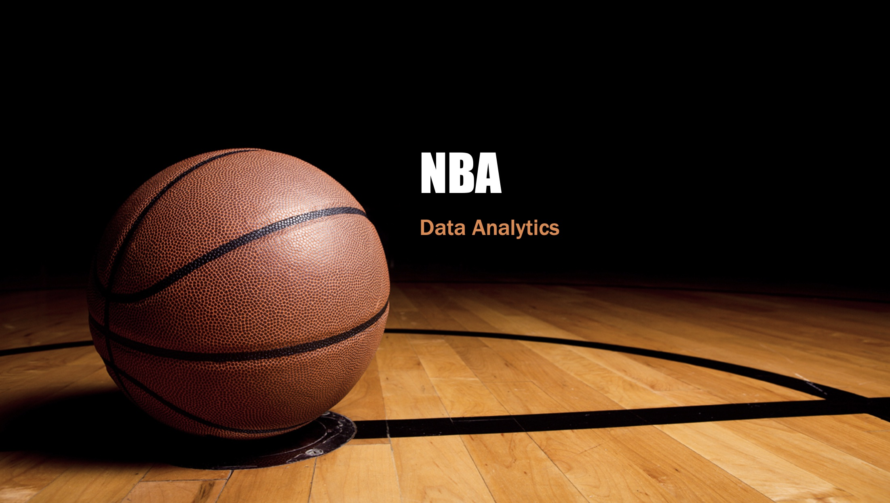

# NBA_salary_analysis

## Background
NBA is one of famous professional sport leagues in the world. Each team has a perceived worth of $1.2 billion or more per Forbes' annual report. The average NBA player salary is $7.7 million for the season (2019 - 2020). The Golden State Warrior star Stephen Curry's earnings for the season (2019 -2020) is $40.2 million. How has the highest paid salaries been determined? Do players who have high game performance always receive high salary contracts?

## Project outline
This project is to analyze stats and salaries of players, find the relationship between game performance and salaries of players and create a machine learning mode to predict salary ranges ($0 - $2,000,000, $2,000,000 - $8,000,000, and more than $8,000,000) using stats. The result of project is hosted as Flask app on AWS. The flask app contains three parts: dashboard, analysis, and prediction.

* dashboard: showing stats of teams and players
* analysis: analyzing salary data of NBA players from 2010 to 2019 seasons 
* prediction: predicting salary using the trained Azure machine learning mode 

[Demo](https://s1ia6rnpx4.execute-api.us-east-1.amazonaws.com/dev/)

### process
1. scraping data of NBA teams and players (2020 season) from basket ball-reference.com for dashboard and upload the data to dynamoDB on AWS. (the deatil is in dashboard folder.)

2. creating analysis using Tableau.

3. scraping stats data of NBA players (2010 - 2019 seasons) from basketball-reference.com, combine the stats data and salary data of NBA players from kaggle.com, training machine learning mode on Azure using the combined data and creating a web application of Azure ML to predict salary. (the deatil is in Azure_ML folder.)

4. creating the Flask app with the dashboard, Tableau analysis, and web application of Azure ML and hosting it on AWS (the detail is in web_app folder.)

## Outcome
Logistic Regression, Random Forest, and neural network classification machine learning models were examined in this project to find an appropriate model for predicting salary ranges ($0 - $2,000,000, $2,000,000 - $8,000,000, and more than $8,000,000) using NBA player stats. (The reason why salay ranges classified into "$0 - $2 million", "$2 million - $8 million", and "more than $8 million" was to keep training data (number of players) equally in each range.)

.png)

The results below were for the three machine learing models. The overall accuracies of the three models were over 60%. The Neural Network model had the highest overall accuracy (69.40%). Changing the parameters of Neural Network model might improve the accuracy. However, there was no significant increase of accuracy after adjusting the parameters (number of hidden nodes: 100 - 500, learning rate: 0.1 - 0.001, number of iterations: 1000 - 10000). This might indicate that there were other factors could affect the salary. Adding new data set (for example, ranking of popur NBA players, jersey sales of NBA players, and so on) might be the next step for this project to improve the accuracy of model. 

### Logistic Regression model:
.png)

### Random Forest model:
.png)

### Neural Network model:
.png)

(In order to create an interactive website, the machine learning model used in the demo website only has 4 stats for input data instead of using all stats.)

## Technology used
* Python, Flask, AWS, S3, DynamoDB, ETL, Azure ML, Tableau, JavaScript (D3, Leaflet, Plotly)
